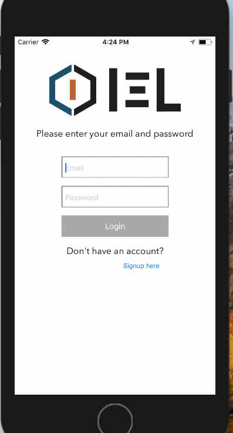

Why, 'Ello, Govna!

# CS 329e Project - IEL App

An app to collect data for the Intelligent Environments Laboratory.

## Functionality
- [x] User sign up, login, and logout
- [x] User login persists
- [x] User can submit a form to the database based on tempature comfortability
- [x] Data bounties enabled
- [x] User can view their data entry history
- [x] User can save their gender, height, and weight
- [x] Location tracking

## Walkthrough

## Some Screenshots
  

## Libraries used?
- [x] Firebase
- [x] CoreLocation
- [x] CoreData
- [x] MKMapView

Copyright [2018] [Henry Vuong, Stepan Ulyanin, Jose Canteli]
